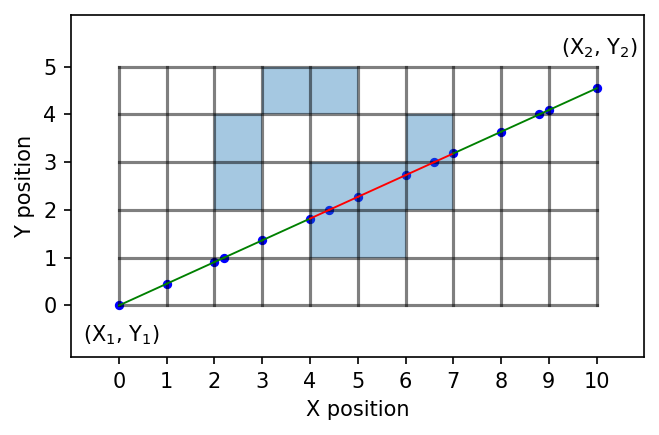

# Sub-pixel Pathlength

This repository contains an algorithm and implementation for calculating the sub-pixel path length along line segments in 2D binary images. 
The key function is "cal_subpx_path" (src.cld.subpx_path) which simply calculates the point of intersection of a line with each pixel, assuming the line starts from the "center" of the first pixel along the line. A example is given (src.example) to show how the code may be used on multiple files or datasets.  

Below is a depiction of the calculation of sub-pixel path length through a simulated 2D binary image. 

Here is a simplified description of the algorithm:  
1. A 2D binary image is input and other required parameters are set (see src.exmaple)
2. A set of the XY-indices of each edge in the image are generated
3. Two points were selected by randomly taking one point from each of two lists of edge indices. These two points became the start and end point of the line segment used to sample the image. 
4. The start and end points were sorted to ensure they are in increasing X index order.
5. The line segment angle, θ, was calculated from tan⁡((Y_n-Y_1)/(X_n-X_1 )), where (X1, Y1) and (Xn, Yn) are the starting and ending points on each line. 
6. A set of X indices were generated at integer spacing between X1 and Xn. 
7. The Y position at each integer X location was calculated using Yi = Y1 + θ (Xi – X1). Similarly, the X position at each integer Y position was calculated. 
8. The two lists of XY positions (at integer X spacing and integer Y spacing) were combined and sorted based on increasing X position. 
9. The pixel values in the binary image, where pores=0 and substrate=1, were extracted for each integer X,Y position in the list which allowed each line segment in the list to be assigned to the pore or substrate space. 
10. The start and end position of consecutive sequences of 0’s and 1’s were extracted and used to calculate the length of the pores and substrate line segments along the line. 

