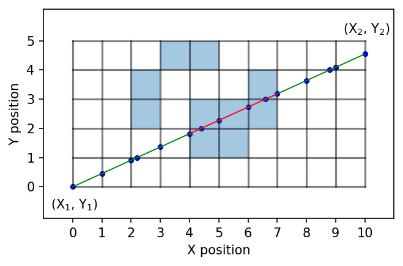

# Sub-pixel Pathlength

This repository contains an algorithm and implementation for calculating the sub-pixel path length along line segments in 2D binary images. 
The key function is "cal_subpx_path" (src.cld.subpx_path) which calculates the point of intersection of a line with each pixel in the array, assuming the line starts from the "center" of the first pixel along the line. An example is given (src.example) to show how the code may be used on multiple files or datasets.  

Below is a depiction of the calculation of sub-pixel path length through a simulated 2D binary image. 

Here is a simplified description of the algorithm:  
1. A 2D binary image is input and other required parameters are set (see src.exmaple)
2. A set of the XY-indices of each edge in the image are generated
3. Two points were selected by randomly taking one point from each of two lists of edge indices. These two points became the start and end point of the line segment used to sample the image. 
4. The start and end points were sorted to ensure they are in increasing X index order.
5. The line segment angle, $\theta$, was calculated from tan⁡(($Y_n$ - $Y_1$)/($X_n$ - $X_1$)), where ($X_1$, $Y_1$) and ($X_n$, $Y_n$) are the starting and ending points on each line. 
6. A set of $X$ indices were generated at integer spacing between $X_1$ and $X_n$. 
7. The $Y_i$ position at each integer $X_i$ location was calculated using $Y_i$ = $Y_1$ + $\theta$ ($X_i$ – $X_1$). Similarly, the $X_i$ position at each integer $Y_i$ position was calculated. 
8. The two lists of $X_i$, $Y_i$ positions (at integer $X$ spacing and integer $Y$ spacing) were combined and sorted based on increasing X position. 
9. The pixel values in the binary image (for example with pores=0 and substrate=1), were extracted for each integer $X_i$, $Y_i$ position in the list which allowed each line segment in the list to be assigned to the pore or substrate space. 
10. The start and end position of consecutive sequences of 0’s and 1’s were extracted and used to calculate the length of the pores and substrate line segments along the line. 

This algorithm was used in the following paper, kindly reference it if you use the code provided in this repo: 

@article{ZHOU2024156200,
title = {Quantitative assessment of the 3D pore space and microglobule clustering network to understand chromatographic transport phenomena in polymeric monolithic columns},
journal = {Chemical Engineering Journal},
volume = {499},
pages = {156200},
year = {2024},
issn = {1385-8947},
doi = {https://doi.org/10.1016/j.cej.2024.156200},
url = {https://www.sciencedirect.com/science/article/pii/S1385894724076915},
author = {Zhuoheng Zhou and Thomas Themelis and Tan Lu and Ryan MacIver and Benoit Stijlemans and Hanrong Wen and Bo Zhang and Gert Desmet and Sebastiaan Eeltink},
keywords = {Serial-block-face SEM, Tomography, Stereological analysis, Liquid chromatography, Column characterization},
abstract = {The 3D pore space and microglobule clustering network of polymer monolithic columns, which exhibited similar external porosity but significantly different chromatographic dispersion and permeability characteristics, were subjected to tomographic imaging followed by stereological analyses. The morphologies of the monolithic support structures were examined using serial-block-face scanning electron microscopy. The statistically computed characteristic chord-length, hydraulic radius and tortuosity of the pore are strongly associated to chromatographic transport processes, in particular, eddy dispersion and mass-transfer resistance contributing to chromatographic dispersion, and permeability of monolithic columns. Moreover, Giddings’ trans-column velocity bias has been quantified in monoliths for the first time. With demonstrated method robustness, the proposed morphological descriptors and the streamlined analysis workflow provide novel insights bridging the structure-performance relationship for future chromatography column design.}
}

